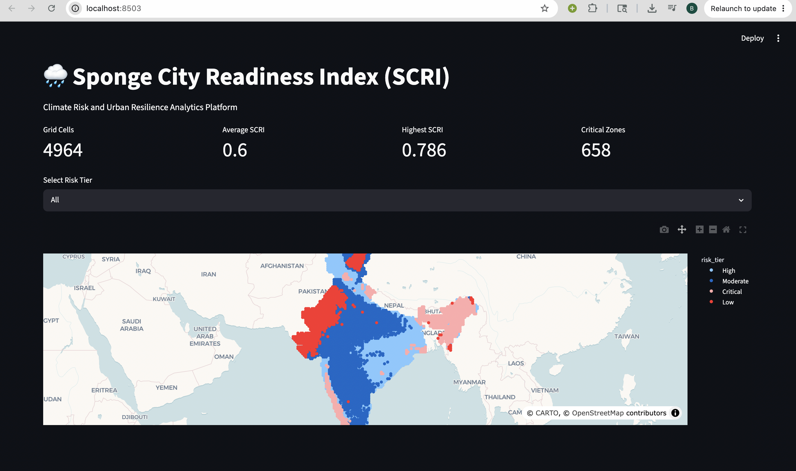
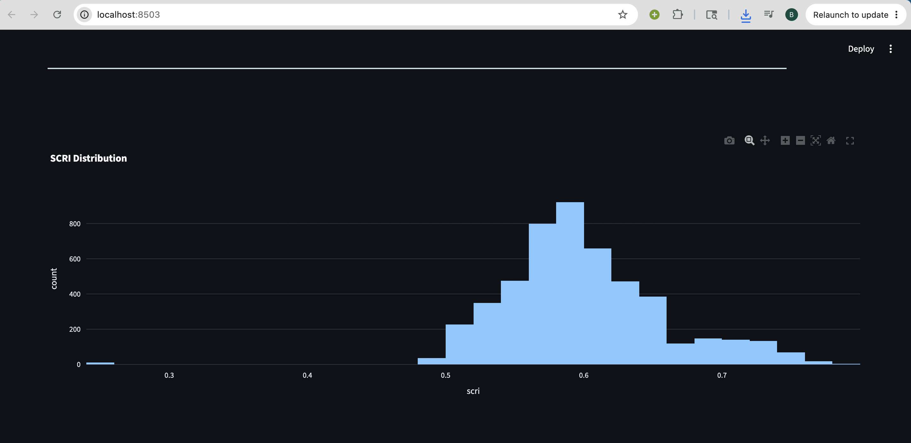

# 🌧 Climate Risk & Sponge City Readiness Analytics Platform

## IEEE GRSS Earth Day Hackathon 2026 – PS-5

An AI-powered climate risk analytics platform that evaluates rainfall stress patterns across India and identifies regions requiring enhanced urban resilience and sponge-city planning.

---

# 📌 Project Overview

Rapid urbanization and changing rainfall patterns are increasing the frequency of urban flooding and climate-related risks.

This project develops a data-driven framework to analyze long-term rainfall patterns across India and generate a **Climate Risk & Sponge City Readiness Index (SCRI)**.

The platform combines:

- Rainfall Analytics
- Risk Scoring
- Machine Learning
- Explainable AI (SHAP)
- Interactive Visualization

to identify climate-stressed regions and support urban resilience planning.

---

# 🎯 Motivation

Traditional flood risk assessments often focus only on rainfall intensity.

However, climate resilience depends on multiple factors such as:

- Rainfall Variability
- Extreme Rainfall Events
- Dry Spells
- Long-Term Climate Patterns

Our goal is to transform raw rainfall observations into actionable climate intelligence that can assist policymakers, urban planners, researchers, and infrastructure stakeholders.

---

# 🌍 Dataset

## Source

- India Meteorological Department (IMD)

## Data Details

| Parameter | Value |
|------------|--------|
| Resolution | 0.25° × 0.25° |
| Coverage | Entire India |
| Time Period | 1981 – 2023 |
| Format | NetCDF |

### Total Analysis Period

**43 Years of Daily Rainfall Observations**

---

# ⚙️ Methodology

## Step 1: Data Processing

- Loaded IMD rainfall datasets
- Merged annual NetCDF files
- Removed non-land and invalid grid cells
- Generated a structured feature matrix

---

## Step 2: Feature Engineering

The following climate indicators were computed:

| Feature | Description |
|----------|------------|
| Mean Annual Rainfall | Long-term rainfall average |
| Standard Deviation | Rainfall variability |
| Coefficient of Variation | Relative rainfall variability |
| Dry Days | Number of low-rainfall days |
| Heavy Rainfall Days | Number of extreme rainfall events |

---

## Step 3: Climate Risk & Sponge City Readiness Index (SCRI)

The final score is computed using a weighted framework:

```text
SCRI =
0.30 × Rainfall Intensity
+ 0.25 × Variability
+ 0.20 × Dry Days
+ 0.25 × Heavy Rainfall Days
```

Higher values indicate greater climate stress and lower rainfall resilience.

---

## Step 4: Risk Classification

Each location is classified into:

- 🟢 Low Risk
- 🟡 Moderate Risk
- 🟠 High Risk
- 🔴 Critical Risk

using statistically derived thresholds.

---

## Step 5: Machine Learning

Random Forest models were used to:

- Analyze climate risk patterns
- Identify dominant drivers of rainfall stress
- Validate the SCRI framework

---

## Step 6: Explainable AI

SHAP (SHapley Additive Explanations) was applied to:

- Interpret model predictions
- Quantify feature importance
- Improve transparency and trust

---

# 📊 Dashboard Features
### DASHBOARD IMAGE


### 🌍 Interactive Risk Map

Visualize climate risk hotspots across India.


### 📈 SCRI Distribution Analysis

Explore score distributions and climate patterns.


### 🧩 Risk Tier Breakdown

Analyze regional risk categories.

### 🚨 Critical Hotspot Identification

Locate high-priority climate risk zones.

### 📥 Downloadable Data

Export processed datasets for further analysis.

---

# 📂 Project Structure

```text
climate-risk-sponge-city-analytics/

├── data/
│   ├── raw/
│   └── processed/
│       └── scri_dataset.csv
│
├── notebooks/
│   ├── 01_rainfall_feature_engineering.ipynb
│   ├── 02_scri_development_and_risk_mapping.ipynb
│   ├── 03_climate_risk_modeling.ipynb
│   ├── 04_model_explainability_shap.ipynb
│   └── 05_interactive_decision_dashboard.ipynb
│
├── dashboard/
│   └── app.py
│
├── requirements.txt
│
└── README.md
```

---

# 🚀 Installation

Clone the repository:

```bash
git clone https://github.com/BhumikaAggwl/climate-risk-sponge-city-analytics.git

cd climate-risk-sponge-city-analytics
```

Install dependencies:

```bash
pip install -r requirements.txt
```

Run the dashboard:

```bash
streamlit run dashboard/app.py
```

---

# 📈 Key Findings

- Heavy rainfall events are major contributors to climate stress.
- Rainfall variability significantly influences regional risk patterns.
- Explainable AI highlights the dominant climatic drivers behind high-risk zones.
- Spatial analytics enables identification of critical climate hotspots across India.

---

# ⚠️ Current Limitations

The current framework primarily focuses on rainfall-derived indicators.

A complete sponge-city readiness assessment should additionally incorporate:

- NDVI / Vegetation Cover
- Drainage Density
- Water Bodies
- Soil Characteristics
- Slope and Terrain
- Land Use / Land Cover

---

# 🔮 Future Work

- Satellite-derived NDVI Integration
- Terrain and Slope Analysis
- Hydrological Modeling
- Spatial Downscaling using Advanced ML Models
- Real-Time Climate Monitoring Dashboard
- State and District-Level Resilience Assessment

---

# 🛠 Technology Stack

- Python
- Pandas
- NumPy
- Xarray
- Scikit-Learn
- Random Forest
- SHAP
- Plotly
- Streamlit

---

# 🏆 Project Impact

This project demonstrates how long-term climate observations, machine learning, and explainable AI can be integrated into a decision-support framework for climate resilience planning.

The proposed Climate Risk & Sponge City Readiness Analytics Platform provides a scalable foundation for identifying climate-stressed regions and supporting data-driven urban planning strategies.

---

# 👩‍💻 Author

**Bhumika Aggarwal**

IEEE GRSS Earth Day Hackathon 2026

Problem Statement 5:
**Climate Risk & Sponge City Readiness Analytics Platform**
